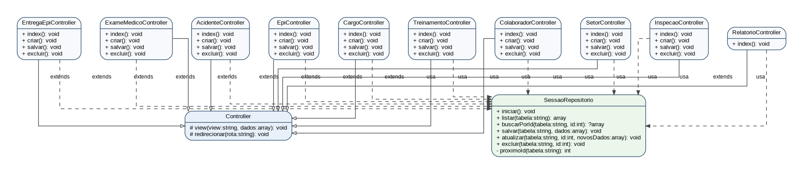

# Documentação do Sistema SST MVC sem Banco de Dados

## 1. Identificação do sistema

**Nome sugerido:** Sistema de Segurança do Trabalho - SST  
**Linguagem:** PHP  
**Arquitetura:** MVC simplificada  
**Persistência temporária:** `$_SESSION`  
**Banco de dados:** Não utilizado nesta versão  

O sistema foi desenvolvido para simular os principais módulos de uma aplicação de Segurança do Trabalho, permitindo cadastrar, listar, excluir e consultar informações armazenadas temporariamente na sessão do navegador.

## 2. Objetivo do sistema

O objetivo do sistema é organizar informações relacionadas à rotina de Segurança e Saúde no Trabalho, como colaboradores, setores, cargos, EPIs, entregas de EPIs, acidentes, exames médicos, treinamentos obrigatórios, inspeções de segurança e relatórios gerais.

Nesta versão, o sistema não utiliza banco de dados. Os registros são armazenados em `$_SESSION`, permitindo testar o fluxo das telas, controllers e regras básicas antes da integração com MySQL, PostgreSQL ou outro SGBD.

## 3. Arquitetura MVC utilizada

O sistema utiliza uma divisão simples em três camadas principais:

### 3.1 Model / Camada de dados simulada

Como não há banco de dados nesta versão, a camada de dados é representada pela classe `SessaoRepositorio`. Essa classe centraliza as operações de inicialização, listagem, busca, salvamento, atualização e exclusão de registros dentro da sessão.

### 3.2 View

As Views são os arquivos responsáveis pela interface visual. Elas ficam na pasta `app/Views` e exibem formulários, tabelas de listagem, menus e relatórios.

### 3.3 Controller

Os Controllers recebem a rota solicitada pelo usuário, chamam o repositório de sessão quando necessário e carregam a View correspondente. Todos os controllers herdam da classe base `Controller`.

## 4. Diagrama de classes

O diagrama abaixo representa as principais classes PHP utilizadas no projeto atual. Os controllers herdam da classe base `Controller` e utilizam a classe `SessaoRepositorio` para manipular os dados em sessão.

Também foi incluído o arquivo `diagrama_classes.mmd`, contendo o mesmo diagrama em sintaxe Mermaid.

## 5. Classes do núcleo do sistema

### 5.1 Classe `Controller`

**Arquivo:** `app/Core/Controller.php`

A classe `Controller` é a classe base da camada de controle. Ela fornece métodos reutilizáveis para carregar Views e redirecionar o usuário para outra rota.

| Método | Visibilidade | Retorno | Finalidade |
|---|---|---:|---|
| `view(string $view, array $dados = [])` | `protected` | `void` | Carrega o cabeçalho, a View solicitada e o rodapé. Também transforma o array de dados em variáveis acessíveis pela View. |
| `redirecionar(string $rota)` | `protected` | `void` | Redireciona o usuário para uma rota do sistema usando `index.php?rota=...`. |

### 5.2 Classe `SessaoRepositorio`

**Arquivo:** `app/Core/SessaoRepositorio.php`

A classe `SessaoRepositorio` substitui temporariamente o papel de um banco de dados. Ela armazena os dados em `$_SESSION`, organizando os registros por tabela lógica.

| Método | Visibilidade | Retorno | Finalidade |
|---|---|---:|---|
| `iniciar()` | `public static` | `void` | Inicia a sessão e cria as estruturas iniciais para os módulos do sistema. |
| `listar(string $tabela)` | `public static` | `array` | Retorna todos os registros armazenados em uma tabela da sessão. |
| `buscarPorId(string $tabela, int $id)` | `public static` | `?array` | Busca um registro específico pelo campo `id`. |
| `salvar(string $tabela, array $dados)` | `public static` | `void` | Adiciona um novo registro à tabela informada e gera um ID automático. |
| `atualizar(string $tabela, int $id, array $novosDados)` | `public static` | `void` | Atualiza os dados de um registro existente. |
| `excluir(string $tabela, int $id)` | `public static` | `void` | Remove um registro da tabela informada. |
| `proximoId(string $tabela)` | `private static` | `int` | Calcula o próximo ID disponível para uma tabela da sessão. |

## 6. Controllers do sistema

### 6.1 `ColaboradorController`

**Arquivo:** `app/Controllers/ColaboradorController.php`  
**Tabela de sessão:** `colaboradores`

Responsável pelo módulo de cadastro de colaboradores. Permite listar, abrir formulário de cadastro, salvar e excluir colaboradores.

| Método | Finalidade |
|---|---|
| `index()` | Lista os colaboradores cadastrados. |
| `criar()` | Carrega o formulário de cadastro de colaborador, incluindo setores e cargos disponíveis. |
| `salvar()` | Recebe os dados enviados por `POST` e salva o colaborador na sessão. |
| `excluir()` | Exclui um colaborador com base no ID recebido por `GET`. |

### 6.2 `SetorController`

**Arquivo:** `app/Controllers/SetorController.php`  
**Tabela de sessão:** `setores`

Responsável pelo cadastro e listagem dos setores da empresa.

| Método | Finalidade |
|---|---|
| `index()` | Lista todos os setores cadastrados. |
| `criar()` | Exibe o formulário de cadastro de setor. |
| `salvar()` | Salva um setor na sessão. |
| `excluir()` | Remove um setor cadastrado. |

### 6.3 `CargoController`

**Arquivo:** `app/Controllers/CargoController.php`  
**Tabela de sessão:** `cargos`

Responsável pelo cadastro e listagem de cargos.

| Método | Finalidade |
|---|---|
| `index()` | Lista todos os cargos cadastrados. |
| `criar()` | Exibe o formulário de cadastro de cargo. |
| `salvar()` | Salva um cargo na sessão. |
| `excluir()` | Remove um cargo cadastrado. |

### 6.4 `EpiController`

**Arquivo:** `app/Controllers/EpiController.php`  
**Tabela de sessão:** `epis`

Responsável pelo controle básico de EPIs cadastrados no sistema.

| Método | Finalidade |
|---|---|
| `index()` | Lista todos os EPIs cadastrados. |
| `criar()` | Exibe o formulário de cadastro de EPI. |
| `salvar()` | Salva os dados de um EPI na sessão. |
| `excluir()` | Remove um EPI cadastrado. |

### 6.5 `EntregaEpiController`

**Arquivo:** `app/Controllers/EntregaEpiController.php`  
**Tabela de sessão:** `entregas_epi`

Responsável pelo registro de entregas de EPIs a colaboradores.

| Método | Finalidade |
|---|---|
| `index()` | Lista as entregas de EPIs registradas. |
| `criar()` | Exibe o formulário de entrega de EPI, carregando colaboradores e EPIs disponíveis. |
| `salvar()` | Registra uma entrega de EPI na sessão. |
| `excluir()` | Remove uma entrega registrada. |

### 6.6 `AcidenteController`

**Arquivo:** `app/Controllers/AcidenteController.php`  
**Tabela de sessão:** `acidentes`

Responsável pelo registro de acidentes de trabalho.

| Método | Finalidade |
|---|---|
| `index()` | Lista os acidentes registrados. |
| `criar()` | Exibe o formulário de registro de acidente, carregando colaboradores disponíveis. |
| `salvar()` | Salva o acidente informado na sessão. |
| `excluir()` | Remove um acidente registrado. |

### 6.7 `ExameMedicoController`

**Arquivo:** `app/Controllers/ExameMedicoController.php`  
**Tabela de sessão:** `exames_medicos`

Responsável pelo cadastro de exames médicos ocupacionais.

| Método | Finalidade |
|---|---|
| `index()` | Lista os exames médicos cadastrados. |
| `criar()` | Exibe o formulário de cadastro de exame médico. |
| `salvar()` | Salva o exame médico na sessão. |
| `excluir()` | Remove um exame médico cadastrado. |

### 6.8 `TreinamentoController`

**Arquivo:** `app/Controllers/TreinamentoController.php`  
**Tabela de sessão:** `treinamentos`

Responsável pelo cadastro de treinamentos obrigatórios.

| Método | Finalidade |
|---|---|
| `index()` | Lista os treinamentos cadastrados. |
| `criar()` | Exibe o formulário de cadastro de treinamento. |
| `salvar()` | Salva o treinamento obrigatório na sessão. |
| `excluir()` | Remove um treinamento cadastrado. |

### 6.9 `InspecaoController`

**Arquivo:** `app/Controllers/InspecaoController.php`  
**Tabela de sessão:** `inspecoes`

Responsável pelo cadastro de inspeções de segurança.

| Método | Finalidade |
|---|---|
| `index()` | Lista as inspeções cadastradas. |
| `criar()` | Exibe o formulário de inspeção, carregando setores disponíveis. |
| `salvar()` | Salva a inspeção na sessão. |
| `excluir()` | Remove uma inspeção cadastrada. |

### 6.10 `RelatorioController`

**Arquivo:** `app/Controllers/RelatorioController.php`

Responsável pela tela de relatórios gerais do sistema.

| Método | Finalidade |
|---|---|
| `index()` | Conta os registros armazenados em cada módulo e envia os totais para a View de relatórios. |

## 7. Views utilizadas

As Views ficam em `app/Views` e são responsáveis pela interface exibida ao usuário.

| Pasta / arquivo | Finalidade |
|---|---|
| `layouts/header.php` | Cabeçalho HTML, menu de navegação e estilos principais. |
| `layouts/footer.php` | Fechamento do layout. |
| `home.php` | Página inicial do sistema. |
| `colaboradores/index.php` | Lista colaboradores. |
| `colaboradores/formulario.php` | Formulário de cadastro de colaborador. |
| `setores/index.php` | Lista setores. |
| `setores/formulario.php` | Formulário de cadastro de setor. |
| `cargos/index.php` | Lista cargos. |
| `cargos/formulario.php` | Formulário de cadastro de cargo. |
| `epis/index.php` | Lista EPIs. |
| `epis/formulario.php` | Formulário de cadastro de EPI. |
| `entregas_epi/index.php` | Lista entregas de EPIs. |
| `entregas_epi/formulario.php` | Formulário de entrega de EPI. |
| `acidentes/index.php` | Lista acidentes. |
| `acidentes/formulario.php` | Formulário de registro de acidente. |
| `exames_medicos/index.php` | Lista exames médicos. |
| `exames_medicos/formulario.php` | Formulário de cadastro de exame médico. |
| `treinamentos/index.php` | Lista treinamentos. |
| `treinamentos/formulario.php` | Formulário de cadastro de treinamento. |
| `inspecoes/index.php` | Lista inspeções de segurança. |
| `inspecoes/formulario.php` | Formulário de cadastro de inspeção. |
| `relatorios/index.php` | Exibe totais gerais e botão de impressão. |

## 8. Funcionamento das rotas

O arquivo `index.php` atua como roteador simples. Ele lê o parâmetro `rota` da URL e instancia o controller correspondente.

Exemplos de rotas:

| URL | Ação esperada |
|---|---|
| `index.php` | Abre a página inicial. |
| `index.php?rota=colaboradores` | Lista colaboradores. |
| `index.php?rota=colaboradores/criar` | Abre o formulário de cadastro de colaborador. |
| `index.php?rota=epis` | Lista EPIs. |
| `index.php?rota=entregas_epi/criar` | Abre o formulário de entrega de EPI. |
| `index.php?rota=relatorios` | Abre os relatórios gerais. |

## 9. Quantitativo de classes e métodos

### 9.1 Classes identificadas

| Nº | Classe | Tipo |
|---:|---|---|
| 1 | `Controller` | Classe base |
| 2 | `SessaoRepositorio` | Repositório em sessão |
| 3 | `ColaboradorController` | Controller |
| 4 | `SetorController` | Controller |
| 5 | `CargoController` | Controller |
| 6 | `EpiController` | Controller |
| 7 | `EntregaEpiController` | Controller |
| 8 | `AcidenteController` | Controller |
| 9 | `ExameMedicoController` | Controller |
| 10 | `TreinamentoController` | Controller |
| 11 | `InspecaoController` | Controller |
| 12 | `RelatorioController` | Controller |

Total: **12 classes**.

### 9.2 Métodos identificados

| Classe | Quantidade de métodos |
|---|---:|
| `Controller` | 2 |
| `SessaoRepositorio` | 7 |
| `ColaboradorController` | 4 |
| `SetorController` | 4 |
| `CargoController` | 4 |
| `EpiController` | 4 |
| `EntregaEpiController` | 4 |
| `AcidenteController` | 4 |
| `ExameMedicoController` | 4 |
| `TreinamentoController` | 4 |
| `InspecaoController` | 4 |
| `RelatorioController` | 1 |

Total: **46 métodos**.

## 10. Observações importantes

1. O sistema atual não possui banco de dados. Os dados são mantidos apenas enquanto a sessão estiver ativa.
2. A classe `SessaoRepositorio` foi criada para simular as operações que futuramente seriam feitas por uma camada de Model ou DAO.
3. O sistema já está organizado de forma adequada para evoluir para um banco de dados posteriormente.
4. Para evolução futura, recomenda-se criar classes Model específicas, como `Colaborador`, `Setor`, `Cargo`, `Epi`, `EntregaEpi`, `Acidente`, `ExameMedico`, `Treinamento` e `InspecaoSeguranca`.
5. Também é recomendado adicionar validações, autenticação de usuários, edição de registros e controle de permissões.

## 11. Conclusão

A estrutura atual atende ao objetivo de demonstrar uma aplicação PHP baseada em MVC, com separação entre rotas, controllers, views e camada de armazenamento simulada. Embora não utilize banco de dados, o projeto permite entender o funcionamento da arquitetura e serve como base para futuras melhorias, como integração com MySQL, autenticação e relatórios mais completos.
